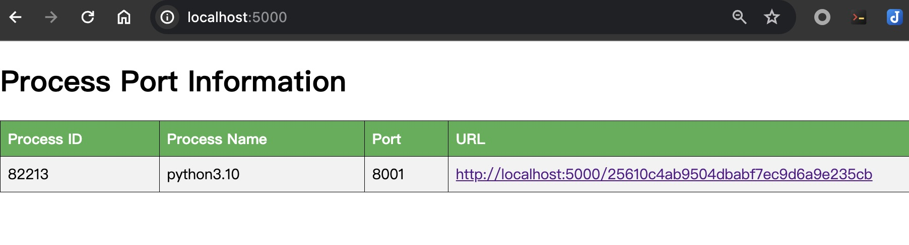
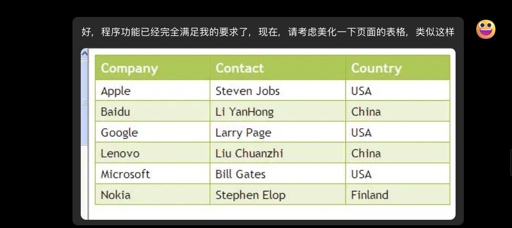

# port-forward
The port-forward port written by python is forwarded to the url(the program is generated by GPT-4o)

## 功能说明：
* 提供类似vscode的端口转发功能
* 程序启动后，扫描当前主机当前用户下的，开启了web端口的app，为它生成一个唯一id的url，并转发端口到url
* 可以通过服务页面查看端口转发列表

## 使用:
```
git clone https://github.com/luckfu/port-forward.git
cd port-forward

python ./port_forwarding.py
```


# GPT-4o 的生成过程
整个编码过程我没有修改任何代码，所有修改和调整都是让llm完成，我只负责复制粘贴执行代码，将执行结果告诉llm，并提出修改意见，例如：

